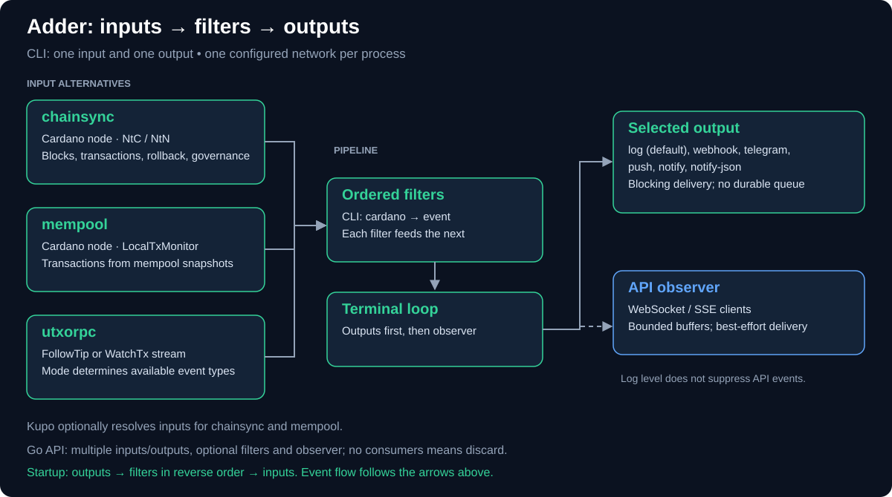
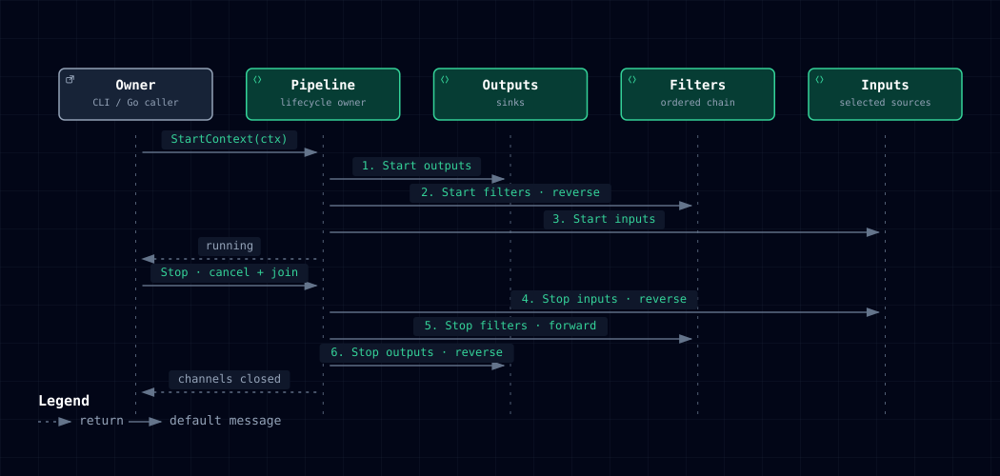
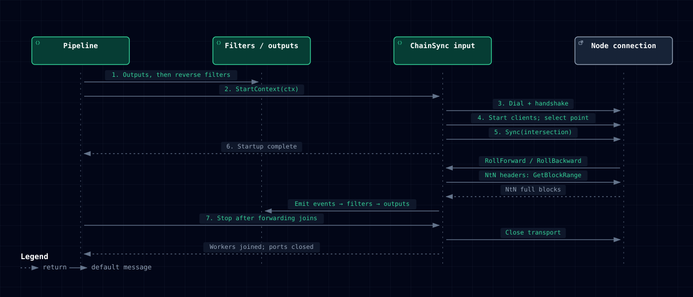

# Adder

<div align="center">
    
</div>

Adder is a tool for tailing the Cardano blockchain and emitting events for each
block and transaction that it sees.

## How it works

Choose an input: `chainsync` reads a Cardano node over NtC or NtN, `mempool`
polls the node's local transaction monitor, and `utxorpc` reads a FollowTip or
WatchTx stream. The CLI selects one input and one output; the defaults are
`chainsync` and `log`.



Events pass through the Cardano and event-type filters before reaching the
selected output and API observer. Outputs apply backpressure; API delivery uses
bounded buffers and can drop events when subscribers are slow.

### Event format

Events are created with a simple schema.

```json
{
  "type": "event type",
  "timestamp": "wall clock timestamp of event",
  "context": "metadata about the event",
  "payload": "the full event specific payload"
}
```

The chainsync input produces `input.block`, `input.rollback`,
`input.transaction`, `input.governance`, `input.drep-registration`,
`input.drep-update`, and `input.drep-retirement`. The last three share the
[DRep certificate payload](event/drep.go). The abbreviated examples below show
field shapes with placeholder values, not recorded ledger data. CBOR fields
are included only when `--input-chainsync-include-cbor` is enabled.

input.block:

```json
{
  "context": {
    "blockNumber": 123,
    "slotNumber": 1234567
  },
  "payload": {
    "blockBodySize": 123,
    "issuerVkey": "a712f81ab2eac...",
    "blockHash": "abcd123...",
    "blockCbor": "85828a1a000995c21..."
  }
}
```

input.rollback:

```json
{
  "payload": {
    "blockHash": "abcd123...",
    "slotNumber": 1234567
  }
}
```

input.transaction:

```json
{
    "context": {
        "blockNumber": 123,
        "slotNumber": 1234567,
        "transactionHash": "0deadbeef123...",
        "transactionIdx": 0
    },
    "payload": {
        "blockHash": "abcd123...",
        "transactionCbor": "a500828258200a1ad...",
        "inputs": [
          "abcdef123...#0",
          "abcdef123...#1"
        ],
        "outputs": [
            {
                "address": "addr1qwerty123...",
                "amount":  12345687,
                "assets": [
                    {
                        "name": "Foo",
                        "nameHex": "abcd123...",
                        "amount": 123,
                        "fingerprint": "asset1abcd...",
                        "policy": "54321..."
                    }
                ]
            }
        ],
        "metadata": {
            "674": {
                "msg": [
                    "Test message"
                ]
            }
        },
        "fee": 1234567,
        "ttl": 123
    }
}
```

input.governance:

```json
{
    "context": {
        "transactionHash": "1234abcd1234abcd...",
        "blockNumber": 123,
        "slotNumber": 1234567,
        "transactionIdx": 0,
        "networkMagic": 1
    },
    "payload": {
        "blockHash": "abcd123...",
        "transactionCbor": "a500828258200a1ad...",
        "proposalProcedures": [
            {
                "index": 0,
                "deposit": 1000000000,
                "rewardAccount": "stake1u9abcd...",
                "actionType": "ParameterChange",
                "actionData": {
                    "parameterChange": {
                        "prevActionId": {
                            "transactionId": "prev_tx_hash...",
                            "govActionIdx": 0
                        },
                        "policyHash": "abcd1234...",
                        "paramUpdate": {
                            "minFeeA": 44,
                            "maxTxSize": 16384
                        }
                    }
                },
                "anchor": {
                    "url": "https://example.com/proposal.json",
                    "dataHash": "abcd1234..."
                }
            }
        ],
        "votingProcedures": [
            {
                "voterType": "DRep",
                "voterHash": "81f156d98e1f02123abccdef5439a89d71fa9d8b76c8db028c7df0e1",
                "voterId": "drep1abcd...",
                "govActionTxId": "action_tx_hash...",
                "govActionIndex": 0,
                "vote": "Yes",
                "anchor": {
                    "url": "https://example.com/vote-rationale.json",
                    "dataHash": "81f156d98e1f02123abccdef5439a89d71fa9d8b76c8db028c7df0e1..."
                }
            }
        ],
        "drepCertificates": [
            {
                "certificateType": "Registration",
                "drepHash": "81f156d98e1f02123abccdef5439a89d71fa9d8b76c8db028c7df0e1",
                "drepId": "drep1abcd...",
                "deposit": 500000000,
                "anchor": {
                    "url": "https://example.com/drep.json",
                    "dataHash": "81f156d98e1f02123abccdef5439a89d71fa9d8b76c8db028c7df0e1..."
                }
            }
        ],
        "voteDelegationCertificates": [
            {
                "certificateType": "VoteDelegation",
                "stakeCredential": "81f156d98e1f02123abccdef5439a89d71fa9d8b76c8db028c7df0e1",
                "drepType": "KeyHash",
                "drepHash": "81f156d98e1f02123abccdef5439a89d71fa9d8b76c8db028c7df0e1",
                "drepId": "drep1abcd..."
            }
        ],
        "committeeCertificates": [
            {
                "certificateType": "AuthHot",
                "coldCredential": "81f156d98e1f02123abccdef5439a89d71fa9d8b76c8db028c7df0e1",
                "hotCredential": "81f156d98e1f02123abccdef5439a89d71fa9d8b76c8db028c7df0e1..."
            }
        ]
    }
}
```

For detailed information about the governance schemas, supported actions, and fields, see the [Governance Event Documentation](./docs/governance.md).

### Log output plugin

`log` is the default output plugin. It writes each filtered event as one text
or JSON line. `--output-log-level` (environment `OUTPUT_LOG_LEVEL`, YAML
`plugins.output.log.level`) controls both event output and application
diagnostics. The default is `info`; accepted levels are `debug`, `info`, `warn`,
and `error`. Event records are INFO-level, so `warn` and `error` consume events
without writing them. API event delivery continues at every log level.
Diagnostics go to stderr at their actual severity, including when another
output plugin is selected.

For errors-only logging:

```sh
adder --output-log-level error
```

The log output plugin supports two formats:

- **text** (default) — human-readable, one line per event:

  ```text
  2026-05-24 12:00:00 BLOCK        slot=2000       block=100      hash=abc123hash era=Babbage txs=5 size=1024
  2026-05-24 12:00:01 TX           slot=2000       block=100      tx=deadbeef12345678 fee=180000 inputs=2 outputs=3
  2026-05-24 12:00:02 ROLLBACK     slot=2000       hash=aabbccdd11223344
  2026-05-24 12:00:03 GOVERNANCE   slot=2000       block=100      tx=govtx12345678abc proposals=1 votes=2 certs=1
  ```

  These examples use placeholder values. Governance logs appear for qualifying
  transactions; rollback logs appear when the node reports a rollback.
  `--filter-type input.block` excludes the other event types.

- **json** — newline-delimited JSON, one JSON object per event (suitable for
  piping to `jq` or other tooling). This abbreviated example is expanded for
  readability; the actual output occupies one line:

  ```json
  {
    "type": "input.block",
    "timestamp": "2026-02-07T09:18:40Z",
    "context": { "blockNumber": 9876543, "slotNumber": 12345678 },
    "payload": { "blockHash": "abc12345..." }
  }
  ```

Select the format with `--output-log-format`:

```bash
adder --output-log-format json
```

By default the log output writes events to **stdout**; `--output-log-path`
selects a file instead. CLI application diagnostics go to **stderr**. With the default
output destination you can capture only event output:

```bash
# Save events to a file, see application diagnostics in the terminal
adder > events.txt

# Pipe events to jq, suppress stderr (including error reports)
adder --output-log-format json 2>/dev/null | jq .

# See only application diagnostics, discard event data
adder > /dev/null
```

### Target-aware notification stream

Desktop integrations can reuse the same target-aware rules as `adder-tray`
without linking a GUI toolkit. The `notify-json` output reserves stdout for
versioned newline-delimited status and notification records and writes runtime
logs to stderr:

```bash
adder \
  --input chainsync \
  --input-chainsync-network preview \
  --output notify-json \
  --output-notify-json-config ~/.config/adder/omarchy.json \
  --api-address 127.0.0.1 \
  --api-port 0
```

For `notify-json`, the resolved chainsync network must match `network.name` in
the notification JSON. A custom node must also match the resolved chainsync
address. The [compatibility check](cmd/adder/notifications.go) uses the same
configuration snapshot as the factories, following CLI > environment > YAML >
defaults for the JSON path, network, and address.

Validate the configuration before starting or restarting a frontend:

```bash
adder notifications validate \
  --config ~/.config/adder/omarchy.json \
  --json
```

The JSON configuration has `schemaVersion: 1` and describes the Cardano
network, monitored wallets/DReps/pools/assets/policies, alert categories, rate
limit, and connection-staleness threshold. An empty target set is rejected
unless `monitor.everything` is explicitly enabled.

## Configuration

Adder resolves core and plugin settings in this order: explicit command-line
arguments, environment variables, YAML, then defaults. Unknown configuration
keys are errors. See the [configuration migration guide](docs/plugin-configuration-migration.md)
for the breaking Go API and precedence changes.

You can get a list of all available commandline arguments by using the
`--help` flag.

```bash
$ ./adder --help

Usage:
  adder [flags]

Flags:
      --config string                 path to config file to load
      --input string                  input plugin to use, 'list' to show available (default "chainsync")
      --input-chainsync-address string
                                      specifies the TCP address of the node to connect to
...
      --output string                 output plugin to use, 'list' to show available (default "log")
      --output-log-level string       logging threshold: debug/info emit events; warn/error suppress events; also filters diagnostics (default "info")
      --output-log-format string      specifies the output format: text (human-readable, default) or json (machine-parseable) (default "text")
      --output-log-path string        specifies the file path to write logs to (default is stdout)
  -h, --help                          help for adder
```

Core setting flags and registered plugin options have corresponding environment
variables. Command controls such as `--config`, `--version`, and `--help` do not. For example, the `--input` option has the `INPUT` environment variable,
the `--input-chainsync-address` option has the `INPUT_CHAINSYNC_ADDRESS`
environment variable, and `--output` has `OUTPUT`.

For plugin options, the environment variable and the config file key are always
built from the plugin **type** and **name** (`<TYPE>_<NAME>_<OPTION>`), even
when the flag itself uses a shortened form. Most plugin flags spell out the
plugin name, so the two match — but the filter flags do not. See
[Filter flags, environment variables, and config keys](#filter-flags-environment-variables-and-config-keys)
for the exact names.

### Environment Variables

Application and plugin settings can be set using environment variables:

- `INPUT` - Input plugin to use (default: "chainsync")
- `OUTPUT` - Output plugin to use (default: "log")
- `KUPO_URL` - URL for Kupo service integration
- `OUTPUT_LOG_LEVEL` - Log plugin threshold, also used for application diagnostics (default: "info")
- `API_ADDRESS` - API server listen address (default: "0.0.0.0")
- `API_PORT` - API server port (default: 8080)
- `DEBUG_ADDRESS` - Debug server address (default: "localhost")
- `DEBUG_PORT` - Debug server port (default: 0)

Genesis configuration can also be controlled via environment variables:

**Network Transition:**

- `SHELLEY_TRANS_EPOCH` - Epoch number when Shelley era begins (default: 208 for mainnet)

**Byron Genesis:**

- `BYRON_GENESIS_END_SLOT` - End slot for Byron era
- `BYRON_GENESIS_EPOCH_LENGTH` - Slot length of Byron epochs (default: 21600)
- `BYRON_GENESIS_BYRON_SLOTS_PER_EPOCH` - Byron slots per epoch

**Shelley Genesis:**

- `SHELLEY_GENESIS_EPOCH_LENGTH` - Slot length of Shelley epochs (default: 432000)

You can also specify each option in the config file.

```yaml
input: chainsync

output: log
```

Plugin arguments can be specified under a special top-level key in the config
file.

```yaml
plugins:
  input:
    chainsync:
      network: preview

  output:
    log:
      level: info
      format: text
```

## Filtering

Adder supports filtering events before they are output using multiple criteria.
Each filter supports specifying multiple possible values separated by commas.
When specifying multiple values for a filter, only one of the values specified
must match an event.

Different filters are combined with **AND** — an event must match every
configured filter to be emitted — with one deliberate exception: `--filter-pool`
and `--filter-drep` are combined with **OR**. See
[Combining filters](#combining-filters) below.

Adder Tray applies target-oriented notification semantics rather than the
generic pipeline rules described below. See
[Adder Tray Filtering and Notification Semantics](./docs/adder-tray-filtering.md)
for target expressions, DRep and pool behavior, and
the current ChainSync notification inventory.

You can get a list of all available filter options by using the `-h`/`--help`
flag.

```bash
$ ./adder --help
...
      --filter-address string   specifies address(es) to filter on (comma-separated)
      --filter-asset string     specifies asset fingerprint(s) to filter on (comma-separated)
      --filter-drep string      specifies DRep ID(s) to filter on (comma-separated, hex or bech32)
      --filter-policy string    specifies asset policy ID(s) to filter on (comma-separated)
      --filter-pool string      specifies Pool ID(s) to filter on (comma-separated)
      --filter-type string      specifies event type to filter on
...
```

The following filters are available:

| Flag               | Filters on                  | Applies to event types                          |
| ------------------ | --------------------------- | ----------------------------------------------- |
| `--filter-type`    | Top-level event type        | all                                             |
| `--filter-address` | Payment or stake address    | `input.transaction`, `input.governance`         |
| `--filter-policy`  | Asset policy ID             | `input.transaction`                             |
| `--filter-asset`   | Asset fingerprint (asset1…) | `input.transaction`                             |
| `--filter-pool`    | Stake pool (SPO) ID         | `input.block`, `input.transaction`, `input.governance` |
| `--filter-drep`    | DRep ID (hex or bech32)     | `input.transaction`, `input.governance`         |

An event type that a given filter does not apply to is passed through
unaffected by that filter. For example, an `input.block` event is never
removed by `--filter-policy`, and an `input.governance` event is never removed
by `--filter-asset`.

> **Note:** long flags require the double-dash form (`--filter-type`). The
> single-dash form (`-filter-type`) is parsed as a cluster of shorthand flags
> and is rejected.

### Combining filters

Filters of different kinds are combined with **AND**: an event must satisfy
every configured filter to be emitted. For example, `--filter-address` together
with `--filter-drep` emits only events that match both.

The one exception is `--filter-pool` combined with `--filter-drep`. Pool IDs and
DRep IDs identify independent actors, so when both are set they are combined
with **OR** — a transaction or governance event matching *either* the pool or
the DRep is emitted. Any other configured filters still apply with AND on top of
that pair.

Note that `input.block` events are matched on the pool alone, because
`--filter-drep` does not apply to block events. Setting both flags therefore
does not widen which blocks are emitted.

### Filter flags, environment variables, and config keys

Filter flags use a shortened form that omits the plugin name, but the
environment variable and the config file key are still built from the plugin
type and name. The three spellings therefore differ, and using the flag name as
an environment variable (for example `FILTER_ADDRESS`) has no effect:

| Flag               | Environment variable     | Config file key                  |
| ------------------ | ------------------------ | -------------------------------- |
| `--filter-address` | `FILTER_CARDANO_ADDRESS` | `plugins.filter.cardano.address` |
| `--filter-asset`   | `FILTER_CARDANO_ASSET`   | `plugins.filter.cardano.asset`   |
| `--filter-policy`  | `FILTER_CARDANO_POLICY`  | `plugins.filter.cardano.policy`  |
| `--filter-pool`    | `FILTER_CARDANO_POOL`    | `plugins.filter.cardano.pool`    |
| `--filter-drep`    | `FILTER_CARDANO_DREP`    | `plugins.filter.cardano.drep`    |
| `--filter-type`    | `FILTER_EVENT_TYPE`      | `plugins.filter.event.type`      |

The `--filter-type` option belongs to the separate `event` filter plugin, which
is why its environment variable and config key use `event` rather than
`cardano`.

The same filters expressed in a config file:

```yaml
plugins:
  filter:
    cardano:
      address: addr1qyht4ja0zcn45qvyx477qlyp6j5ftu5ng0prt9608dxp6l2j2c79gy9l76sdg0xwhd7r0c0kna0tycz4y5s6mlenh8pq4jxtdy
      pool: pool1z5uqdk7dzdxaae5633fqfcu2eqzy3a3rgtuvy087fdld7yws0xt
      drep: drep1p4h4ea7y70ede2wy7x3t83x4umm63wwq68308f94cmt7szexmnr

    event:
      type: input.governance
```

Each value is a single string; use a comma-separated list for multiple values,
exactly as on the command line.

## Using Adder as a Library

Adder can be used as a Go library to build custom blockchain indexers and applications.
The [examples](./examples/) directory contains starter code demonstrating various use cases:

- **[adder-publisher](./examples/adder-publisher/)** - Basic event publisher that logs all blockchain events
- **[poolid-filter](./examples/poolid-filter/)** - Filter events by stake pool ID
- **[event-address-filter](./examples/event-address-filter/)** - Filter by addresses and native assets

### Pipeline startup and shutdown

Outputs start first, then filters in reverse chain order, then inputs. This
makes downstream consumers ready before sources begin producing events.



`Stop` cancels and joins forwarding workers before stopping plugins in reverse
startup order. Call it even after canceling the startup context. Shutdown can
leave events in upstream buffers; it does not guarantee delivery of every
in-flight event. See the [plugin authoring guide](docs/plugin-authoring.md) for
resource ownership and cancellation requirements.

## Example usage

### Native using remote node

```bash
export INPUT_CHAINSYNC_NETWORK=preview
./adder
```

Alternatively using equivalent commandline options:

```bash
./adder \
  --input-chainsync-network preview
```

### In Docker using local node

First, follow the instructions for
[Running a Cardano Node](https://github.com/blinklabs-io/docker-cardano-node#running-a-cardano-node)
in Docker.

```bash
docker run --rm -ti \
  -v node-ipc:/node-ipc \
  ghcr.io/blinklabs-io/adder:main
```

### ChainSync connection and events

For the node connections above, ChainSync completes the handshake, starts its
protocol clients, selects an intersection, and starts synchronization.
Node-to-node headers trigger BlockFetch requests; node-to-client callbacks
already contain full blocks and skip that exchange.



Callbacks can begin before startup returns. Rollbacks produce separate events.
After startup, a lost connection is retried when auto-reconnect is enabled;
otherwise it fails the pipeline. During shutdown, ChainSync closes its connection
and joins its workers before filters and outputs are stopped.

### Filtering

#### Filtering on event type

Only output `input.transaction` event types

```bash
adder --filter-type input.transaction
```

Only output `input.transaction` and `input.block` event types

```bash
adder --filter-type input.transaction,input.block
```

Only output governance events

```bash
adder --filter-type input.governance
```

#### Filtering on asset policy

Only output transactions involving an asset with a particular policy ID

```bash
adder --filter-type input.transaction \
  --filter-policy 13aa2accf2e1561723aa26871e071fdf32c867cff7e7d50ad470d62f
```

#### Filtering on asset fingerprint

Only output transactions involving a particular asset

```bash
adder --filter-type input.transaction \
  --filter-asset asset108xu02ckwrfc8qs9d97mgyh4kn8gdu9w8f5sxk
```

#### Filtering on a policy ID and asset fingerprint

Only output transactions involving both a particular policy ID and a particular
asset (which do not need to be related)

```bash
adder --filter-type input.transaction \
  --filter-asset asset108xu02ckwrfc8qs9d97mgyh4kn8gdu9w8f5sxk \
  --filter-policy 13aa2accf2e1561723aa26871e071fdf32c867cff7e7d50ad470d62f
```

#### Filtering on an address

Only output transactions with outputs matching a particular address

```bash
adder --filter-type input.transaction \
  --filter-address addr1qyht4ja0zcn45qvyx477qlyp6j5ftu5ng0prt9608dxp6l2j2c79gy9l76sdg0xwhd7r0c0kna0tycz4y5s6mlenh8pq4jxtdy
```

#### Filtering on a stake address

Only output transactions with outputs matching a particular stake address

```bash
adder --filter-type input.transaction \
  --filter-address stake1u9f9v0z5zzlldgx58n8tklphu8mf7h4jvp2j2gddluemnssjfnkzz
```

#### Filtering on multiple addresses

Pass multiple values to a single filter as a comma-separated list. The event
matches if it involves _any_ of the listed addresses.

```bash
adder --filter-type input.transaction \
  --filter-address addr1qyht4ja0zcn45qvyx477qlyp6j5ftu5ng0prt9608dxp6l2j2c79gy9l76sdg0xwhd7r0c0kna0tycz4y5s6mlenh8pq4jxtdy,addr1q88zh70hsfjkqnexte4u5ewsfpjq3dxrhlvr3ha7k99p3y8rtwtt945eg3tvmg09t8f4ug4dw24nednp598w4vlycgqsry583e
```

Payment and stake addresses can be mixed in the same list:

```bash
adder --filter-type input.transaction \
  --filter-address addr1qyht4ja0zcn45qvyx477qlyp6j5ftu5ng0prt9608dxp6l2j2c79gy9l76sdg0xwhd7r0c0kna0tycz4y5s6mlenh8pq4jxtdy,stake1u834h94j66v5g4kd58j4n567y2kh92eukes6znh2k0jvyqgfufmts
```

A stake address is the broader of the two: a payment address matches only that
exact address, while a stake address matches any address built on that stake
credential — including other payment addresses of the same wallet — as well as
stake certificates in the transaction. Both are checked against the
transaction's outputs. They are also checked against its resolved inputs — so
that spending *from* a matching address counts, not just receiving to one — but
when Kupo is configured and resolves the inputs successfully. CLI users can
set `KUPO_URL`, top-level `kupo_url`, or the input's `kupo-url` option; direct
Go constructors require `WithKupoUrl`. Adder needs the resolved output to
identify the address an input spends.

#### Filtering on a stake pool (SPO)

Only output blocks minted by a particular stake pool. Pool IDs may be given in
either bech32 (`pool1…`) or hex form.

```bash
adder --filter-type input.block \
  --filter-pool pool1z5uqdk7dzdxaae5633fqfcu2eqzy3a3rgtuvy087fdld7yws0xt
```

To filter on multiple stake pools, pass a comma-separated list of IDs. Multiple
values are combined with **OR** semantics (events matching _any_ of the listed
pool IDs will be output). You can mix both bech32 and hexadecimal formats in the
list:

```bash
adder --filter-type input.block \
  --filter-pool pool1z5uqdk7dzdxaae5633fqfcu2eqzy3a3rgtuvy087fdld7yws0xt,a81f156d98e1f02123abccdef5439a89d71fa9d8b76c8db028c7df0e
```

#### Filtering on a DRep

Only output governance events involving a particular DRep — votes cast by that
DRep, that DRep's registration/update/retirement certificates, and vote
delegations to that DRep. DRep IDs may be given in either bech32 (`drep1…` /
`drep_script1…`) or hex form.

```bash
adder --filter-type input.governance \
  --filter-drep drep1p4h4ea7y70ede2wy7x3t83x4umm63wwq68308f94cmt7szexmnr
```

> **DRep ID formats accepted by `--filter-drep`:**
>
> - **Bech32:** any value beginning with `drep` — both the `drep1…` (key-hash)
>   and `drep_script1…` (script-hash) prefixes. Adder decodes the value and
>   expects a 28-byte credential hash. If the decoded payload is 29 bytes, the
>   leading byte is treated as a header and dropped; Adder does not inspect or
>   validate that byte. Payloads of any other length are ignored, and the ID is
>   silently dropped from the filter.
> - **Hexadecimal:** the raw 28-byte credential hash (56 hexadecimal
>   characters), with no leading header byte. Hex input is stored exactly as
>   decoded — nothing is stripped — so a value carrying a header byte will not
>   match.
>
> Adder itself emits DRep IDs as the bech32 encoding of the raw 28-byte
> credential hash, using the `drep` prefix for key-hash credentials and
> `drep_script` for script-hash credentials. Values copied from Adder's own
> `drepId` output can always be passed back to `--filter-drep` unchanged.

The `--filter-drep`, `--filter-pool`, and `--filter-address` filters also apply
to `input.governance` events. See the
[Governance events](#governance-events) section for exactly what each filter
matches against in a governance event.

### Push notifications

The example shows how push notification output can be used with filtering
options. In this example, push notifications will be sent for the block events.
Push notifications will be sent to the FCM `project_id` specified in the
`serviceAccount.json` file. Please refer to the
[adder-mobile README](https://github.com/blinklabs-io/adder-mobile) for more
details on how to send push notifications to mobile.

```bash
adder --filter-type input.block \
  --output push \
  --output-push-serviceAccountFilePath /path/to/serviceAccount.json
```

## Governance events

The chainsync input emits an `input.governance` event for every transaction
that contains Conway-era on-chain governance data. Each time a qualifying transaction is processed, it
produces one `input.governance` event, and that event collects all of
the governance data found in the transaction.

Rollbacks and replay can cause the same transaction to be processed again;
this is not an exactly-once delivery guarantee. Schema and extraction logic
are in [event/governance.go](event/governance.go).

### When it fires

An `input.governance` event is emitted when a transaction contains any of the
following:

- one or more **proposal procedures** (new governance actions),
- one or more **voting procedures** (votes cast on governance actions), or
- one or more **governance certificates** — DRep
  registration/update/retirement, vote-delegation, or Constitutional Committee
  hot-key authorization/cold-key resignation.

Transactions with no governance data do not produce an `input.governance`
event. The governance event is emitted _in addition to_ the regular
`input.transaction` event for the same transaction.

### Context

The `context` object identifies the transaction and chain position the
governance data was found in:

| Field             | Type   | Description                                  |
| ----------------- | ------ | -------------------------------------------- |
| `transactionHash` | string | Hash of the transaction (hex)                |
| `blockNumber`     | number | Block height containing the transaction      |
| `slotNumber`      | number | Slot of the containing block                 |
| `transactionIdx`  | number | Index of the transaction within the block    |
| `networkMagic`    | number | Network magic of the connected node          |

### Payload

The `payload` object always contains `blockHash`, optionally
`transactionCbor` (only when the input is run with
`--input-chainsync-include-cbor`), and up to five arrays of governance data.
Each array is omitted when empty. `anchor` objects are always serialized;
when no anchor is available their `url` and `dataHash` fields are empty strings.
Certificate `deposit` fields use `omitempty` and are absent when zero.

| Field                        | Type  | Description                                              |
| ---------------------------- | ----- | -------------------------------------------------------- |
| `blockHash`                  | string | Hash of the containing block (hex)                      |
| `transactionCbor`            | string | Raw transaction CBOR (hex); present only with `--input-chainsync-include-cbor` |
| `proposalProcedures`         | array | Governance actions proposed in this transaction          |
| `votingProcedures`           | array | Votes cast in this transaction                           |
| `drepCertificates`           | array | DRep registration / update / retirement certificates     |
| `voteDelegationCertificates` | array | Vote-delegation certificates                             |
| `committeeCertificates`      | array | Constitutional Committee hot-auth / cold-resign certs    |

#### `proposalProcedures[]`

| Field           | Type   | Description                                                     |
| --------------- | ------ | --------------------------------------------------------------- |
| `index`         | number | Index of the proposal within the transaction                    |
| `deposit`       | number | Deposit (lovelace) locked for the proposal                      |
| `rewardAccount` | string | Stake/reward address the deposit is returned to                 |
| `actionType`    | string | One of `ParameterChange`, `HardForkInitiation`, `TreasuryWithdrawal`, `NoConfidence`, `UpdateCommittee`, `NewConstitution`, `Info`, or `Unknown` |
| `actionData`    | object | Action-specific data; for recognized actions one field is populated, keyed by the action (e.g. `parameterChange`, `treasuryWithdrawal`, `newConstitution`, `updateCommittee`, `hardForkInitiation`, `noConfidence`, `info`) |
| `anchor`        | object | `{ "url", "dataHash" }`; empty strings when no metadata anchor is supplied |

#### `votingProcedures[]`

| Field            | Type   | Description                                                |
| ---------------- | ------ | ---------------------------------------------------------- |
| `voterType`      | string | One of `DRep`, `SPO`, `CCHot`, or `Unknown`                              |
| `voterHash`      | string | Voter credential hash (hex)                                |
| `voterId`        | string | Voter identifier (bech32 where applicable)                 |
| `govActionTxId`  | string | Transaction ID of the governance action being voted on     |
| `govActionIndex` | number | Index of the governance action within that transaction     |
| `vote`           | string | One of `Yes`, `No`, `Abstain`, or `Unknown`                              |
| `anchor`         | object | `{ "url", "dataHash" }`; empty strings when no vote anchor is supplied    |

#### `drepCertificates[]`

| Field             | Type   | Description                                                |
| ----------------- | ------ | ---------------------------------------------------------- |
| `certificateType` | string | One of `Registration`, `Update`, `Deregistration`         |
| `drepHash`        | string | DRep credential hash (hex)                                 |
| `drepId`          | string | DRep ID in bech32 (`drep1…` or `drep_script1…`)            |
| `deposit`         | number | Deposit (lovelace); omitted when zero (registration/deregistration) |
| `anchor`          | object | `{ "url", "dataHash" }`; empty strings when absent                  |

#### `voteDelegationCertificates[]`

| Field             | Type   | Description                                                              |
| ----------------- | ------ | ----------------------------------------------------------------------- |
| `certificateType` | string | One of `VoteDelegation`, `StakeVoteDelegation`, `VoteRegistrationDelegation`, `StakeVoteRegistrationDelegation` |
| `stakeCredential` | string | Delegating stake credential hash (hex)                                  |
| `drepType`        | string | One of `KeyHash`, `ScriptHash`, `Abstain`, `NoConfidence`               |
| `drepHash`        | string | DRep credential hash (hex); present for `KeyHash`/`ScriptHash`          |
| `drepId`          | string | DRep ID in bech32; present for `KeyHash`/`ScriptHash`                   |
| `poolKeyHash`     | string | Pool key hash (hex); present for the combined stake+vote delegation types |
| `deposit`         | number | Deposit (lovelace); omitted when zero (registration-delegation types)       |

#### `committeeCertificates[]`

| Field             | Type   | Description                                            |
| ----------------- | ------ | ------------------------------------------------------ |
| `certificateType` | string | `AuthHot` (hot-key authorization) or `ResignCold`      |
| `coldCredential`  | string | Committee cold credential hash (hex)                   |
| `hotCredential`   | string | Committee hot credential hash (hex); present for `AuthHot` |
| `anchor`          | object | Always serialized; strings are empty unless `ResignCold` supplies metadata |

### Filtering governance events

Three of the Cardano filters apply to `input.governance` events. A governance
event matches a filter if any of the listed data references the filtered value:

- **`--filter-drep`** — matches DRep certificates, vote-delegation
  certificates that delegate to the DRep, and voting procedures where the voter
  is the DRep.
- **`--filter-pool`** — matches voting procedures cast by the pool as an SPO,
  and vote-delegation certificates referencing the pool's key hash.
- **`--filter-address`** — what this matches depends on the kind of address you
  pass:
  - A **stake address** (`stake1…`) matches a proposal's `rewardAccount`,
    treasury-withdrawal destination addresses, and the stake credential of
    vote-delegation certificates.
  - A **payment address** (`addr1…`) matches treasury-withdrawal destination
    addresses only. Reward accounts and vote-delegation credentials are stake
    credentials, and are only ever compared against stake addresses.

  To follow an account's governance activity, pass its stake address.

The `--filter-policy` and `--filter-asset` filters do **not** apply to
governance events; an `input.governance` event passes through them unaffected.

Example — only governance events involving a specific DRep:

```bash
adder --filter-type input.governance \
  --filter-drep drep1p4h4ea7y70ede2wy7x3t83x4umm63wwq68308f94cmt7szexmnr
```

## Additional Documentation

- [Local CLI integration tests](docs/testing/local-integration.md): run
  `./scripts/test-integration.sh` to check logging thresholds, diagnostic
  levels, configuration precedence, filtering, startup failures, RPC recovery,
  SSE delivery, health, and shutdown using a local UTxO RPC fixture.

For more detailed information, setup manuals, and architecture details, see the
following:

- [Architecture](./docs/architecture.md) — Input capabilities, lifecycle
  contracts, configuration, and delivery guarantees.
- [Dingo-Adder Local N2C Connection Architecture](./docs/dingo-adder.md) —
  Detailed description, text-based connection diagrams, and data flows of our
  local UNIX socket orchestration.
- [Dingo macOS Setup & QA Verification Guide](./docs/dingo-macos-setup.md) —
  Concise setup and verification guide for running Dingo and Adder (on Docker
  Compose and macOS Native container virtual machines).
- [Governance Event Documentation](./docs/governance.md) — Detailed information
  about governance schemas, supported actions, and fields.
- [Adder Tray Filtering and Notification Semantics](./docs/adder-tray-filtering.md)
  — Troubleshooting and detailed configuration guides for the system tray
  application.

### Writing plugins

See the [plugin authoring guide](docs/plugin-authoring.md) for the managed
interfaces, cancellation and failure contracts, immutable event ownership,
and registration steps. Start from the [compiled examples](examples/plugins)
and run the [public lifecycle tests](plugintest/contract.go) in your plugin's
test suite. The [architecture](docs/architecture.md) links each runtime contract
to its implementation and regression tests.
