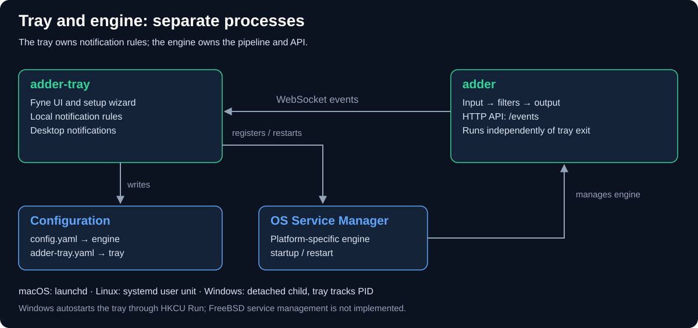

# Architecture & Concurrency Model

This document describes the high-level architecture, plugin system, configuration precedence, and concurrency model of Adder.

---

## 1. High-Level Overview

Adder is built around a concurrent **Pipeline-Plugin** architecture. Data flows from **Inputs**, through a sequence of **Filters** (each running in its own goroutine), into **Outputs**. Every stage is connected by Go channels, and every plugin runs concurrently with its neighbors.


### Topology

`Pipeline` stores inputs, filters, and outputs as slices. `AddInput`,
`AddFilter`, and `AddOutput` configure the topology before startup. Inputs merge
into the first filter; each filter feeds the next. Without filters, inputs feed
the terminal output loop directly. See [pipeline.go](../pipeline/pipeline.go).

The `adder` CLI uses a narrower subset of that capability:

- **Exactly one input**: the plugin named by `--input` / `INPUT` (`chainsync`, `mempool`, or `utxorpc`).
- **Every registered filter**: `cardano` then `event`, in registration order.
- **Exactly one output**: the plugin named by `--output` / `OUTPUT` (`log`, `webhook`, `telegram`, `push`, `notify`, or `notify-json`). The default is `log`.
- **API observer**: a best-effort copy of events after filtering.

Embedding the `pipeline` package directly in your own Go program unlocks the
multi-input / multi-output form, including pipelines with no output or observer.
With no consumers the terminal loop drains and discards events. The application
uses one network per process; input network selection does not replace the
shared genesis configuration used for epoch calculations.

### Input plugins

| Plugin | Source | Events before filtering |
| --- | --- | --- |
| `chainsync` | Cardano node: NtC over a UNIX socket or explicitly enabled TCP; NtN over TCP | Blocks, transactions, rollbacks, governance, and DRep certificates |
| `mempool` | Cardano node LocalTxMonitor | Transactions from polled snapshots; hashes present in the previous poll are suppressed |
| `utxorpc`, `follow-tip` mode (default) | UTxO RPC `SyncService.FollowTip` | Apply: block, transaction, governance, DRep events; Undo/Reset: rollback |
| `utxorpc`, `watch-tx` mode | UTxO RPC `WatchService.WatchTx` | Apply: transaction, governance, DRep events; Undo: rollback |

Governance and certificate events require the corresponding transaction data.
UTxO RPC payload completeness depends on the provider; its parsed protobuf path
cannot supply fields absent from the schema. `watch-tx` is a provider stream,
not the mempool plugin's polling protocol. See the implementations in
[chainsync](../input/chainsync/chainsync.go), [mempool](../input/mempool/mempool.go),
and [utxorpc](../input/utxorpc/mapper.go).

---

## 2. The Plugin System

All inputs, filters, and outputs implement `ManagedPlugin`, defined in
[plugin/plugin.go](../plugin/plugin.go):

```go
type Lifecycle interface {
    StartContext(context.Context) error
    Stop() error
    FailureReporter
}

type FailureReporter interface {
    Failed() <-chan struct{}
    Failure() error
}

type ManagedPlugin interface {
    Lifecycle
    Role() PluginType
    ErrorChan() <-chan error
    InputChan() chan<- event.Event
    OutputChan() <-chan event.Event
}
```

Built-ins embed [plugin.Base](../plugin/base.go), which owns private channels,
cancellation, worker tracking, and failure reporting. Plugins expose channels
through methods; callers must not close them. Base is optional for custom
implementations. Its mutexes mean an embedding plugin must not be copied.
Concrete built-ins retain `Start()` as a convenience wrapper around
`StartContext(context.Background())`.

`StartRun` creates each run's channels and runs setup. Workers registered through
`Base.Go` must respect cancellation; cleanup hooks unblock and release their
resources. Failed setup cleans up before returning. `Stop` cancels the run,
joins workers, and closes its channels. Call `Stop` even after cancellation or
terminal failure, and reacquire channels after restart. The pipeline owns the
lifecycle of connected instances; do not share an instance across pipelines.
See [Writing a plugin](plugin-authoring.md) for implementation and test examples.

### Auto-Registration Mechanism

Adder uses Go's package initialization mechanism for auto-registering plugins.

1. Each plugin package registers itself in an `init()` block calling `plugin.Register()`.
2. Central registration files blank-import the implementations: [input/input.go](../input/input.go), [filter/filter.go](../filter/filter.go), and [output/output.go](../output/output.go).
3. `Register` validates and copies the definition. The CLI resolves options, then constructs independent instances through `NewFromOptionsFunc(plugin.Options) (plugin.ManagedPlugin, error)`.

Factories validate settings without starting workers or contacting remote
services. Go callers can construct plugins directly or use
`plugin.GetPlugin(kind, name, values)` with defaults plus explicit values.
The [embedded output](../output/embedded/embedded.go) is available to Go callers
but is not a CLI registration.

---

## 3. Configuration Precedence

Core and plugin settings use **explicit CLI > environment > YAML > defaults**.
[Config.LoadWithFlags](../internal/config/config.go) loads core settings;
[ResolveConfig](../plugin/register.go) creates an immutable plugin snapshot.
Unknown keys, duplicate YAML keys, and invalid scalar values are errors, even
for unselected plugins. Required credentials and other plugin-specific checks
apply when constructing the selected plugins.

Plugin YAML keys match option names under `plugins.<type>.<name>`, including
hyphens such as `socket-path`. Generated environment names use
`<TYPE>_<NAME>_<OPTION>` (for example, `INPUT_CHAINSYNC_ADDRESS`). Custom aliases
such as `CARDANO_NETWORK` take precedence within the environment tier;
explicit CLI flags still win. `CustomFlag` replaces the generated flag name
with `--<type>-<customflag>`, as in `--filter-address`.

Explicit false, zero, and empty strings are preserved. Top-level `kupo_url` is a
fallback only when an input's YAML omits `kupo-url`. Direct Go constructors use
`WithKupoUrl`. Configuration reload does not reconfigure a running pipeline.

`--output-log-level`, `OUTPUT_LOG_LEVEL`, and `plugins.output.log.level` set
one logging threshold (default `info`). Event records are INFO-level;
`warn`/`error` consume them without writing. Application diagnostics use the
same threshold on stderr, including with another output plugin. See the
[log output documentation](../README.md#log-output-plugin) and
[configuration migration guide](plugin-configuration-migration.md).

---

## 4. Concurrency & Goroutine Model

### Active Goroutines

1. **Main**: Configures the pipeline and API, then waits for SIGINT/SIGTERM or terminal pipeline failure.
2. **Input workers**: Own source connections, protocol callbacks, and reconnection/polling loops.
3. **Pipeline workers**: `chanCopyLoop` bridges each stage; `outputChanLoop` sends to outputs sequentially, then attempts a nonblocking observer send. A slow output applies backpressure; a full observer channel drops the event. Error and failure watchers supervise each started plugin.
4. **Filter and output workers**: Consume their input channels. Base defaults to 10 buffered events; plugins may request a larger buffer. Webhook and Telegram implement their own delivery retries.
5. **API server**: Serves `/events` over WebSocket or SSE. Its bounded EventHub can drop events for slow clients. `/v1/fcm` and `/v1/qrcode` routes are registered only with the push output.

Events and referenced payload/context data are immutable after publication.
Fan-out copies the event struct, not its maps or slices; transformations must
copy the data they change. See [event.Event](../event/event.go).

### Startup and Shutdown


[Pipeline.StartContext](../pipeline/pipeline.go) starts outputs first, filters
in reverse chain order, then inputs. It installs downstream forwarding before
starting upstream stages. The diagram shows a successful run; if startup fails,
forwarding is canceled and joined, then successfully started plugins stop in
reverse order. The plugin whose startup failed cleans up its own partial setup.

`Pipeline.Stop` cancels the shared context, joins forwarding workers, stops
acquired plugins in reverse startup order, and closes pipeline channels.
This means inputs stop before filters and outputs. Shutdown can abandon upstream
buffered events; output draining does not guarantee end-to-end delivery.
Stop has no universal timeout, so plugin operations must cooperate with
cancellation. See [stopPlugins](../pipeline/topology.go).

Recoverable errors use `ErrorChan`. `Base.Fail` retains the first terminal error
and closes `Failed` independently of that channel. Pipeline failure cancels
forwarding and marks the pipeline unhealthy; the owner must still call `Stop`.
The CLI stops the pipeline, closes the event hub, then shuts down the API with a
ten-second deadline. That deadline does not bound the preceding pipeline stop.
`/healthcheck` reports pipeline running state, not event freshness or delivery.

### ChainSync Connection and Events


[ChainSync.StartContext](../input/chainsync/chainsync.go) dials and handshakes,
starts the protocol clients, selects the intersection, and calls `Sync`.
Callbacks can begin before startup returns. NtN headers trigger BlockFetch;
NtC callbacks already contain full blocks. Rollbacks emit separate events.
The node lane groups client operations and transport, not individual wire messages.

An initial connection error fails startup. Later disconnections trigger
cancellation-aware reconnects when enabled, otherwise terminal failure.
Shutdown closes the connection before and after joining tracked workers, covering
an in-flight reconnect, then Base closes the ports. Filters and outputs stop
after the inputs.

---

## 5. Adder Tray Application Architecture

The `adder-tray` system tray application (`cmd/adder-tray/` and `tray/`) does **not** run or wrap the core pipeline itself — no code under `tray/` or `cmd/adder-tray/` imports the `pipeline` package. As the doc comment on `ConnectionManager` (`tray/connection.go`) puts it, "the tray no longer manages adder as a subprocess but connects to it as an API client". `adder` runs as a separate per-user background process and the tray talks to it over a WebSocket to `GET /events` (`tray/events.go`, gorilla `websocket.DefaultDialer`); the SSE path in `api/events.go` is the server's fallback for clients that do not request an upgrade, not something the tray uses.

### Key Components

- **Fyne GUI Engine**: `cmd/adder-tray/main.go` creates the Fyne app; `tray/app.go` type-asserts it to `desktop.App` and drives the tray menu and icon through `SetSystemTrayMenu` / `SetSystemTrayIcon` (`app.go`), swapping the icon as connection status changes.
- **Setup Wizard (`tray/wizard/`)**: A step-by-step Fyne flow that assists the user in generating configuration. `SetupRunner.Apply` (`tray/setup/runner.go`) persists the plan as two separate files: the engine's `config.yaml` (read by the `adder` background process) and the tray's own `adder-tray.yaml` (`tray/config.go`). The tray file holds API address/port, autostart, notification prefs, the notification filter, and the rate-limit settings — see the `TrayConfig` struct at `tray/setup/store.go`. The filter deliberately lives in the tray config rather than the engine config so the tray's notification engine owns target matching (`runner.go`).
- **Rules Engine & Rule Derivation (`tray/notifications/`)**:
  - `RulesFromPlan` (`tray/notifications/rules.go`) translates a `setup.SetupPlan` into concrete `Rule` values, with per-target helpers such as `walletRules`, `drepRules`, `poolRules`, `assetRules`, and `policyRules`.
  - The engine rate-limits notifications: matches beyond `NotifyRateLimit` within `NotifyRateWindow` are coalesced into one batched request emitted at the window boundary, and a non-positive limit disables coalescing (`tray/notifications/engine.go`). Defaults are 1 notification per 5 seconds (`tray/setup/store.go`); a configured zero loads the default and a negative limit disables rate limiting.
- **System Service Integration (`tray/setup/`)**:
  - `SetupRunner.Apply` calls `Service.EnsureRegistered` then `Service.RestartIfConfigChanged` and afterwards points the tray's API connection at the configured address/port (`runner.go`). Both service failures are *soft*: the config is still persisted and surfaced via `ApplyResult`.
  - The `ServiceManager` implementation is per-platform: a launchd LaunchAgent plist driven by `launchctl` on macOS (`service_darwin.go`), a systemd **user** unit on Linux (`service_linux.go`), and on Windows an HKCU `...\CurrentVersion\Run` value that autostarts the *tray*, with the tray launching `adder.exe` itself as a detached, windowless child tracked by PID (`service_windows.go`). Windows deliberately avoids Task Scheduler and Windows Services so nothing requires elevation. FreeBSD is stubbed out and returns "FreeBSD service management is not implemented" (`service_freebsd.go`).
  - `App.Shutdown()` (`tray/app.go`) closes the tray's quit channel, disconnects its API connection, stops the notification engine, and quits the Fyne app — it does not stop the `adder` process, which keeps running independently.

### Architectural Layout



The "OS Service Manager" box registers and restarts `adder` through the
platform backend behind `ServiceManager` (`SetupRunner.Apply`,
`tray/setup/runner.go`). On macOS and Linux the OS supervises the
process and the tray never holds a handle to it; on Windows there is no
service supervisor, so the tray starts `adder.exe` as a detached child and
tracks it by PID (`tray/setup/service_windows.go`). Either way the
pipeline runs in the `adder` process, not in the tray. `adder` reads only
`config.yaml` and runs its own `Input -> Filter -> Output` pipeline and API
server. The tray's rule derivation (`tray/notifications/rules.go`) turns a
`SetupPlan` into desktop-notification rules locally — those rules are never
sent to the `adder` process.
