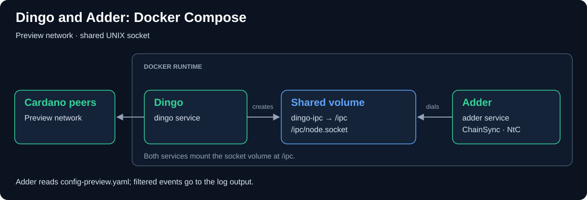

# Dingo-Adder Connection Architecture

This document describes how **Dingo** and **Adder** are connected and
interact with each other inside our local development environment on the
`preview` network.

## Connection Graph

## Detailed Data Flow

1. **Cardano Syncing:** Dingo connects outward to public peer nodes on the
    Cardano `preview` network. [docker-compose.yml](../docker-compose.yml)
    selects `--network preview` and mounts persistent data at `/data`.
2. **UNIX Socket Creation:** Dingo initializes and creates a UNIX Domain Socket
    at `/ipc/node.socket`. Since the folder `/ipc` is mapped to the `dingo-ipc`
    named volume, both containers access the same socket.
3. **N2C Pipeline Connection:** Adder mounts the same `dingo-ipc` volume at
    `/ipc`. Adder starts up, reads `config-preview.yaml`, and initiates a
    connection to `/ipc/node.socket` using the **Node-to-Client (N2C)**
    Ouroboros protocol.
4. **Log Emission:** Events passing the filters are written to stdout by the
    log output plugin, which Docker captures. This includes transactions and
    governance events when present, as well as blocks and rollbacks.

Compose orders startup with `depends_on` but does not wait for socket readiness.
Its `restart: unless-stopped` policy retries an initial connection failure.

---

## macOS Native Setup

For step-by-step instructions on running this connection natively on macOS
(with UNIX domain socket bridging), see the
[Dingo macOS Setup Guide](./dingo-macos-setup.md).
