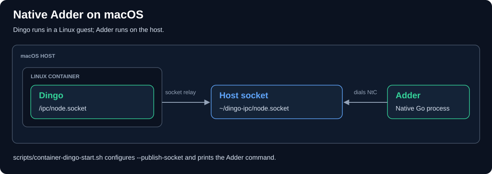

# Dingo QA Manual

This manual outlines the concise setup and verification steps for testing the
Adder event-streaming pipeline against the Dingo Go Cardano node on the
`preview` network.

---

## 1. Local Orchestration Setup (Docker & Compose)

Docker Compose runs both services with log rotation configured as `max-size: 5m`
and `max-file: 2` per container. Database storage is separate from log rotation.

### Start the Stack

Navigate to the repository worktree and start the containers in the background:

```bash
docker compose up --build -d
```

---

## 2. Real-Time Verification Checks (Docker)

### Step A: Verify Connection and Intersect

By default, the `config-preview.yaml` configuration is configured with `intersect-tip: true`. This instructs Adder to perform a ChainSync intersection at the current tip of the Dingo node instead of starting from Genesis (slot 0).

1. **First-Time Sync:** An empty node can report genesis; a syncing node can
   report an older tip. The first slot depends on Dingo's current sync state.

Verify that Dingo has booted, Adder successfully connected to the UNIX domain socket, completed the intersection handshake, and is processing blocks:

```bash
docker compose logs adder | tail -n 20
```

Look for connection success and `BLOCK` records. The README shows the
[text event formats](../README.md#log-output-plugin), including `TX`, `GOVERNANCE`,
and `ROLLBACK`. Event records require log level `info` or `debug`.

2. **Verifying ChainSync Intersection (Active Tip):** To explicitly exercise and verify the intersection logic with a non-genesis tip, allow the stack to run and sync some blocks (e.g., until slot 100 or higher). Then, restart only the `adder` service:

```bash
docker compose restart adder
```

Now, check the logs again:

```bash
docker compose logs adder | tail -n 20
```

Adder requests a fresh intersection at the node's reported tip. Compare the
recent slots before and after restart; immediate event arrival is not guaranteed.
A rollback can legitimately produce a lower slot.

### Step B: The "Something Weird" Check (On-Demand Grep)

At any point, execute this single-line command to instantly filter out normal
operational output and identify anomalies (such as deserialization failures,
network disconnect loops, or restarts):

```bash
docker compose logs | grep -iE "error|panic|warn|reconnect"
```

---

## 3. Teardown and Cleanup (Docker)

When testing is complete, stop the containers. The following command also
deletes the named volumes, including Dingo's database; omit `-v` to retain them:

```bash
docker compose down -v
```

---

## 4. Native Adder on macOS

The helpers use [apple/container](https://github.com/apple/container) with
`--publish-socket` to expose Dingo's `/ipc/node.socket` as
`~/dingo-ipc/node.socket`. Adder runs as a native Go process on the Mac, so
local debuggers can attach to it.



### Step-by-Step macOS Native Guide

#### Step A: Install `apple/container`

Compile and install the tool on your macOS system by following the official
[apple/container Building from Source](https://github.com/apple/container#building-from-source)
instructions.

#### Step B: Start Dingo with Native Socket Bridging

We provide an automated helper script `./scripts/container-dingo-start.sh` in the
repository root to start the Apple native container services, create your host
socket directories, and launch the Dingo container automatically:

```bash
./scripts/container-dingo-start.sh
```

#### Step C: Run Adder Natively on your macOS Host

Run Adder directly as a macOS Go process pointing to the bridged UNIX socket
file on your Mac disk:

```bash
# Execute Adder on Mac from the repository root, connecting directly to the
# bridged socket file (this command is also printed by the start script!)
go run ./cmd/adder --config config-preview.yaml --input chainsync \
  --input-chainsync-socket-path ~/dingo-ipc/node.socket \
  --input-chainsync-network preview \
  --input-chainsync-intersect-tip=true \
  --output log
```

#### Step D: Clean Up and Teardown

To cleanly stop Dingo, delete local socket files, and shut down Apple's
background container daemon, simply run our stop helper script:

```bash
./scripts/container-dingo-stop.sh
```
